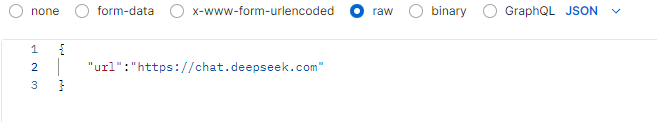
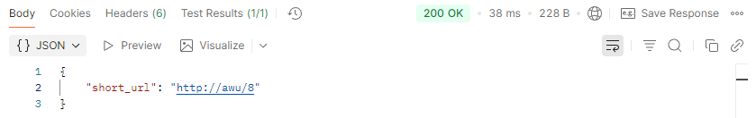
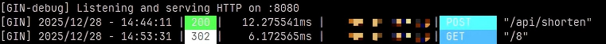

# Go URL Shortener  
一个基于**Golang+Gin+MySQL**实现的短链接服务，用于将长链接转换为短链接，并在访问时进行重定向和访问次数统计。  

---
## 功能特点
- 生成短链接
- 通过短链接重定向
- 统计短链接访问次数
- 数据持久化到MySQL数据库
- 支持后端服务独立部署
---
## 技术栈
- Golang
- Gin Web Framework
- MySQL
- GORM ORM
- Linux/云服务器环境

---
## 项目结构

```text
URLShortener/
├── API/                       # 接口层（HTTP 请求入口）
│   ├── createShortURLAPI.go   # 创建短链接接口
│   └── redirectAPI.go         # 短链接重定向接口
│
├── Config/                    # 配置相关
│   └── initDB.go              # 数据库初始化与连接
│
├── Models/                    # 数据模型层
│   └── url.go                 # URL 数据结构，与数据库表映射
│
├── Routes/                    # 路由定义
│   └── router.go              # API 路由注册与分发
│
├── Service/                   # 业务逻辑层
│   └── increasesVisitCount.go # 访问次数自增逻辑
│
├── Utils/                     # 工具函数
│   └── generateShortCode.go   # 短链接编码生成（Base62）
│
├── main.go                    # 程序入口，初始化并启动服务
├── go.mod                     # Go 模块依赖管理
└── README.md                  # 项目说明文档
```
---
## 部署与运行
本项目采用**本地开发+云服务器运行**的方式进行部署。  
代码在本地开发完成后，打包上传至云服务器，在云服务器上编译运行。
---
### 1.上传代码至云服务器
使用`git`在服务器上拉取代码
```bash
git clone https://github.com/awu123-create/URLShortener.git
```

### 2.配置服务器环境
确保云服务器已安装以下环境：
- Golang（项目使用的是`go1.25.5`）
- MySQL（确保MySQL服务已启动，并创建好数据库）
- Git（用于拉取代码）
- Linux（Ubuntu）

### 3.编译并启动服务
进入项目目录：
```bash
cd URLShortener
```
下载依赖并编译：
```bash
go mod tidy
go build -o url_shortener
```
启动服务：
```bash
./url_shortener
```
服务启动成功后，监听在`8080`端口。

---
## 接口测试
使用Postman进行接口测试。
### 1.创建短链接
1. 打开Postman，新建一个**POST请求**，输入URL（使用公网IP）：

2. 在 Body → raw → JSON 填入请求参数：

3. 点击Send，查看响应结果：

### 2.访问短链接
1. 复制响应中的短链接URL，在浏览器中打开（由于创建短连接时返回的域名是虚构的，此处需将响应的URL中的域名部分换成云服务器的公网IP）：  

2. 浏览器会自动重定向到原始长链接

### 3.服务器日志
查看服务器终端日志
